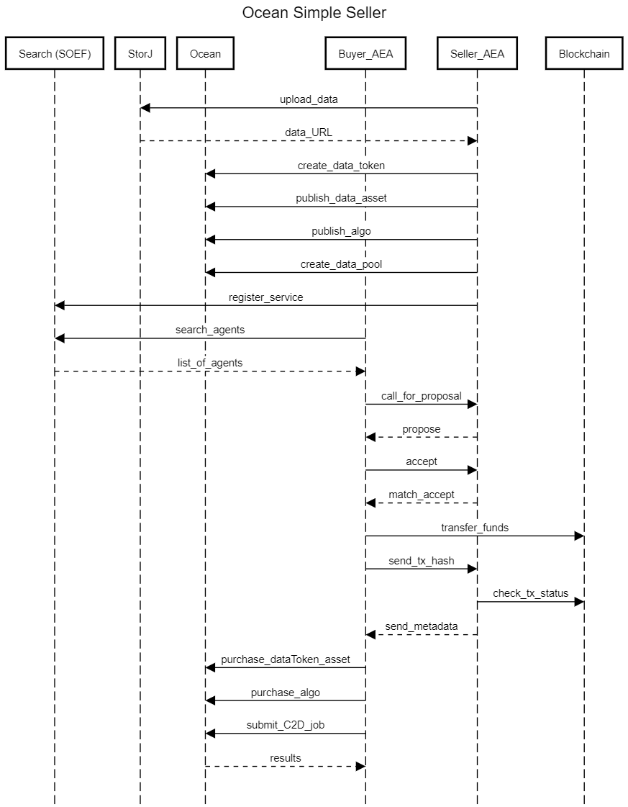

# Ocean Simple Seller

This repo contains all the code needed to demo a simple seller and buyer AEAs on the Ocean marketplace with data hosted on StorJ.

The following list briefly explains the workflow:

- Seller agent uploads data to StorJ and receives public URL for that data
- Seller agent creates data token, it publishes the data asset to Ocean as well as the algorithm for C2D and then it creates the fixed rate exchange for purchasing datatokens.
- Seller agent registers itself on the SOEF with this service.

- Buyer agent searches for this agent on the SOEF, and when it finds the seller agent, it buys the service and it receives metadata needed for further inquires.
- Buyer agent then purchases the data asset from Ocean marketplace and the algorithm for the C2D job
- Buyer agent submits the C2D job and it receives results.

This flow is visualized in the following sequence diagram.

For this demo we use the Ocean Network available on Polygon and S3 Compatible Gateway for StorJ. 

These agents are available under `src/packages/eighballer`.

